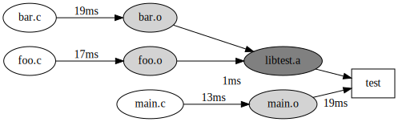

# eyec

A tool to spy on your C/C++ compiler.

# How does it work?

`eyec` will work like `ccache` or `distcc`. It will wrap your c/c++ compiler and
other build tools (`ar`, `ld`, etc) and will record in a report all their
activities while their compiling your project.

It works by creating links to `eyec` with the same name as the tool your want
to spy. Then redirect your `PATH` to those links. When the compiler is called, 
your build system will, in effect, call `eyec` which will record the compilers
parameters, call the original compiler with the same parameters and once done
enrich a report with the duration of the activity.

The produced report can then be read with `graph.js` provided in the `src`
folder to generate a dot file that graphviz can interpret to generate a graph.
The graph will show the flow of compilation from the sources to the objects to
the libraries and executables.

# Usage

Supposing `eyec` binary is in `~/.local/bin`. Create a folder of links such as:
```
~/some/path/cc -> ~/.local/bin/eyec
~/some/path/gcc -> ~/.local/bin/eyec
~/some/path/g++ -> ~/.local/bin/eyec
~/some/path/ar -> ~/.local/bin/eyec
etc
```

In your project then, compile with the your `PATH` environment variable pointing to
the links folder:
```bash
$ PATH=~/some/path/:$PATH make
```

`eyec-report.json` will be created.

Then use `src/graph.js` to create a `.dot` file:
```bash
$ node ~/to/eyec/src/graph.js eyec-report.json | dot -Tsvg > output.svg
$ open output.svg
```



# How to compile

```bash
$ git clone <this_repo>
$ cd eyec
$ cargo build
```
